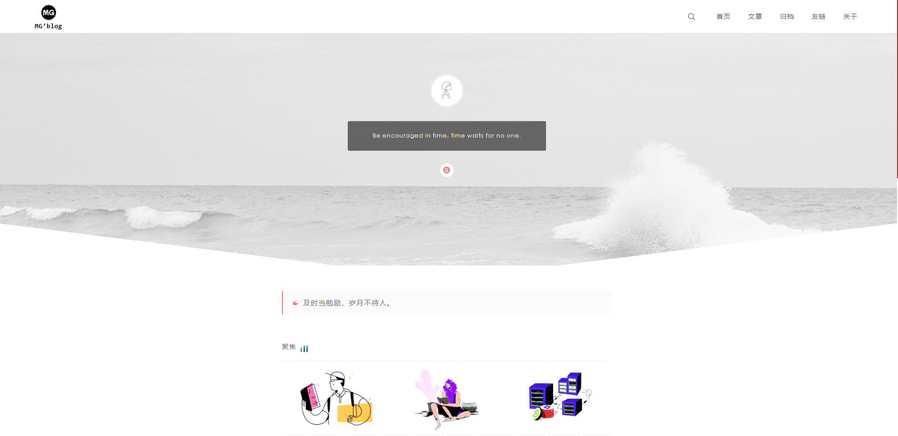
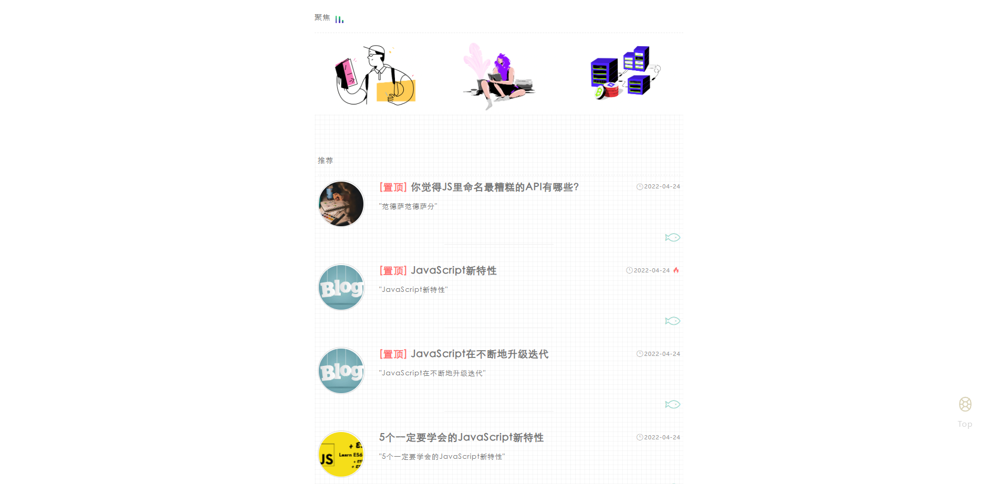
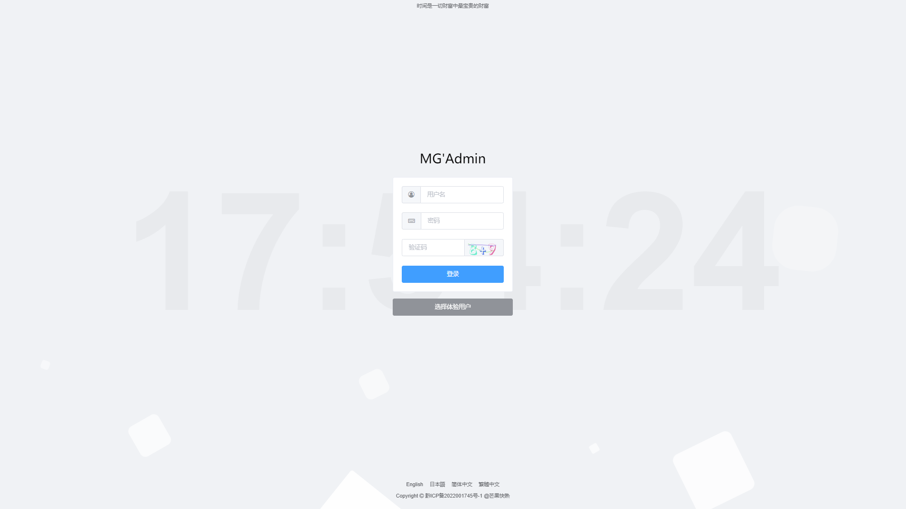
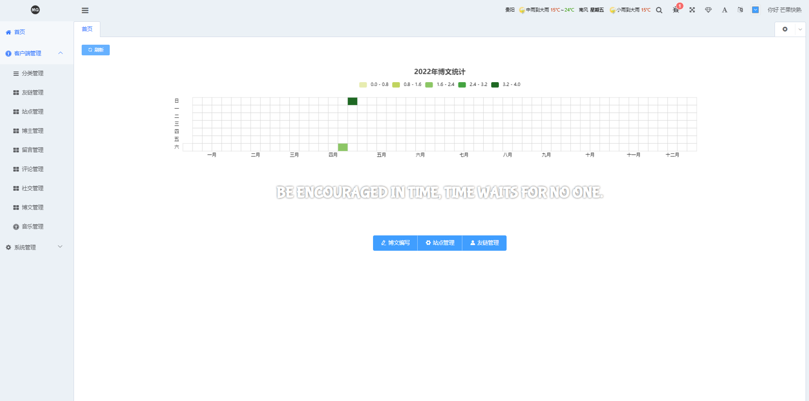
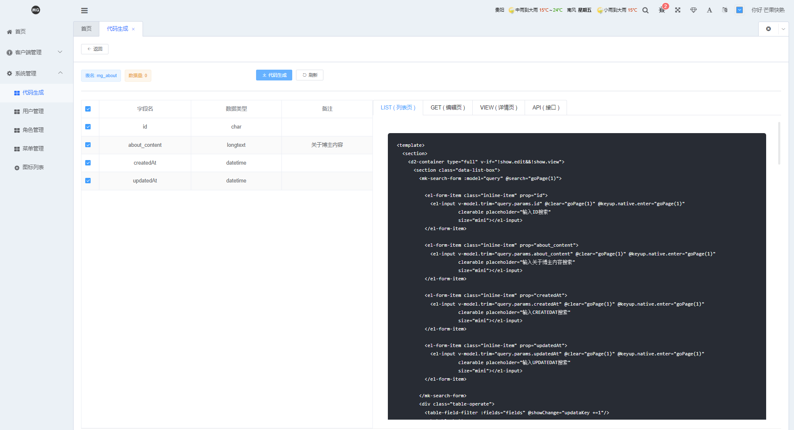

# 🔥🥯🥯 Mango-Blog-System ⭐⭐

#### 🛠 v1.0.2 介绍
芒果’个人博客系统，包括前后台完整基础功能，开箱即用，对你有用可以 star ⭐⭐  谢谢大佬们，本项目将会持续维护...

<!-- PROJECT SHIELDS -->

<!-- PROJECT LOGO -->

 

  

<h3 align="center">"Mango-Blog-System"</h3>
  

    一个 "开箱即用" 个人博客全栈系统项目！
     
    <a href="https://gitee.com/Z568_568/all-blog-sys"><strong>探索本项目的源码 »</strong></a>
     
     
    <a href="http://www.zhouyi.run/#/">前台Demo</a>
    ·
    <a href="http://zhouyi.run:5221/#/index">管理端Demo</a>

***

#### 功能列表

- [x] 登录
- [x] 用户管理
- [x] 菜单管理
- [x] 角色管理
- [x] 文章管理
- [x] 分类管理
- [x] 标签管理
- [x] 评论管理
- [x] 归档管理
- [x] 站点管理
...

> 
##### 🥯接口文档

> https://console-docs.apipost.cn/preview/85df1005c24df829/b25c320b5df19b98

> 项目截图

 
 
 
 
 
 
 
 
 
