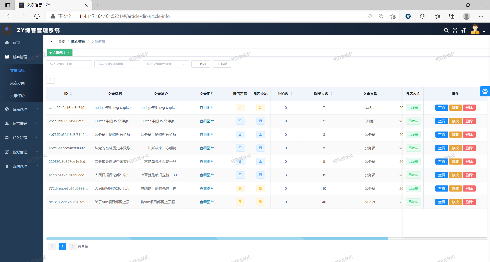

# zy-all-blog

#### 介绍
个人博客全站系统，`vue2 + node.js + express + mysql` 包含前端博客展示、后台管理、node后端代码。整套完整博客系统

#### 安装教程

1.  前端依赖 安装 node-sass 不行 就下载yarn 安装即可

### DEMO 
1.  [前端web端 ZY-Blog](http://114.117.164.181/#/)

2.  [博客管理端 ZY-admin](http://114.117.164.181:5221/#/login?redirect=%2F)

> 前端项目web端截图

> 前端项目管理Admin端截图

